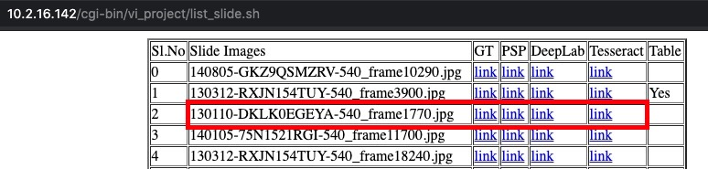
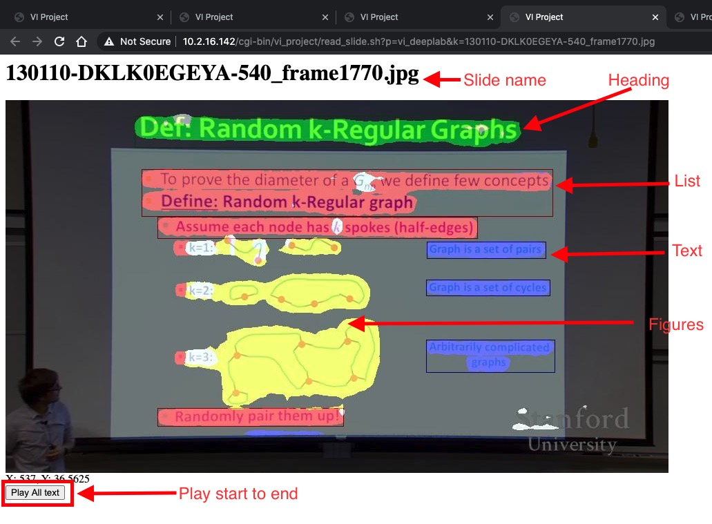

# Slide Reading System Evaluation Protocol
Slide presentations have been successfully used for an efficient and effective way of classroom teaching in the last three decades. However, blind and visually impaired (VI) students are not benefited by this way of teaching due to their limitation in reading slides. This shortcoming motivates us to design a system which can generate audio sound corresponding to the reading order of each slide and can help the blind and VI students to understand and interpret the content of the slides. 
## Technical aspects
This problem is posed as an image-to-markup language generation task. Extraction of meaningful regions like title, paragraph, list, equation, figure, table, etc from the slide image is the initial step. Due to the diversity of content, theme and layout of the slides, extraction of meaningful regions is a challenging task. We present an classroom slide narration system based on the semantic segmentation of classroom slide image. Here, we pose the extraction of meaningful regions as a pixel-wise classification task which is closely related to natural image semantic segmentation task in computer vision. 
We uses the recently published dataset of classroom slides to demonstrate our results. We improve the classroom segmentation accuracy using synthetic classroom slide and its automatically generated groundtruth.  We also used unlabelled classroom slide images to improve the segmentation accuracy.

## How to evaluate the system?
### Step1:
Open the list of slide images [here](http://10.2.16.142/cgi-bin/vi_project/list_slide.sh)
 
The list contains 332 slide images.
Each image has four outputs links given under the title of GT, PSP, DeepLab, and tesseract. The column titled "Table" indicates whether the slide image contains a table or not. 
#### Each evaluator can randomly choose a minimum of 5 slide images and evaluate all the outputs corresponds to those images.
Eg: if you chose the image name "130110-DKLK0EGEYA-540_frame1770.jpg", then you suppose to evaluate all the outputs correspond to that image. (red marked boxes) 

### Step1: Evaluate the output
We have four different outputs for a slide image. We request you to evaluate the efficiency of these outputs for conveying the slide content to a visually impaired student.
#### Open the output links [eg link](http://10.2.16.142/cgi-bin/vi_project/read_slide.sh?p=vi_deeplab&k=130110-DKLK0EGEYA-540_frame1770.jpg)

